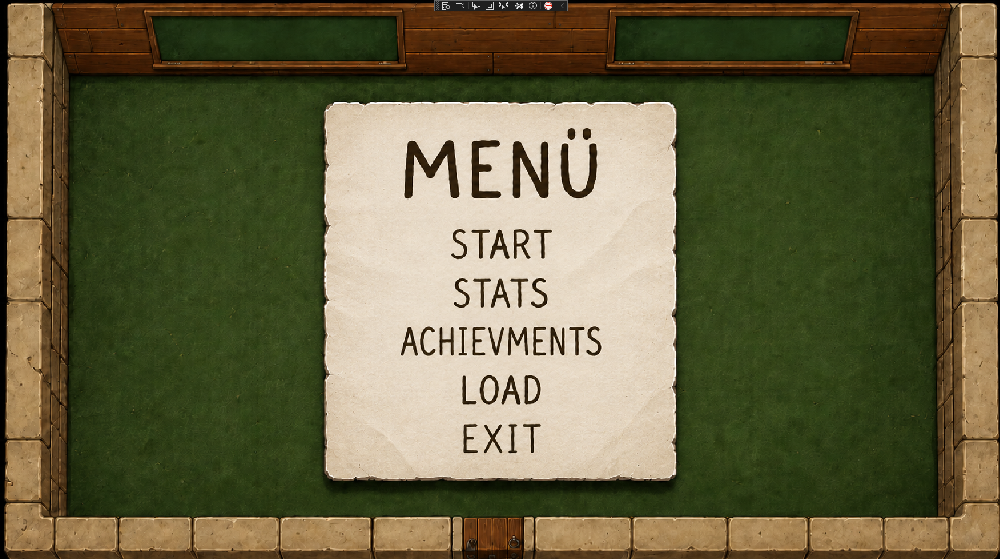
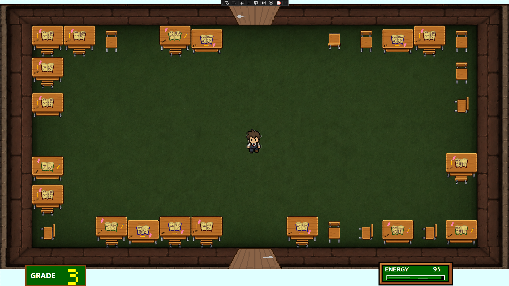
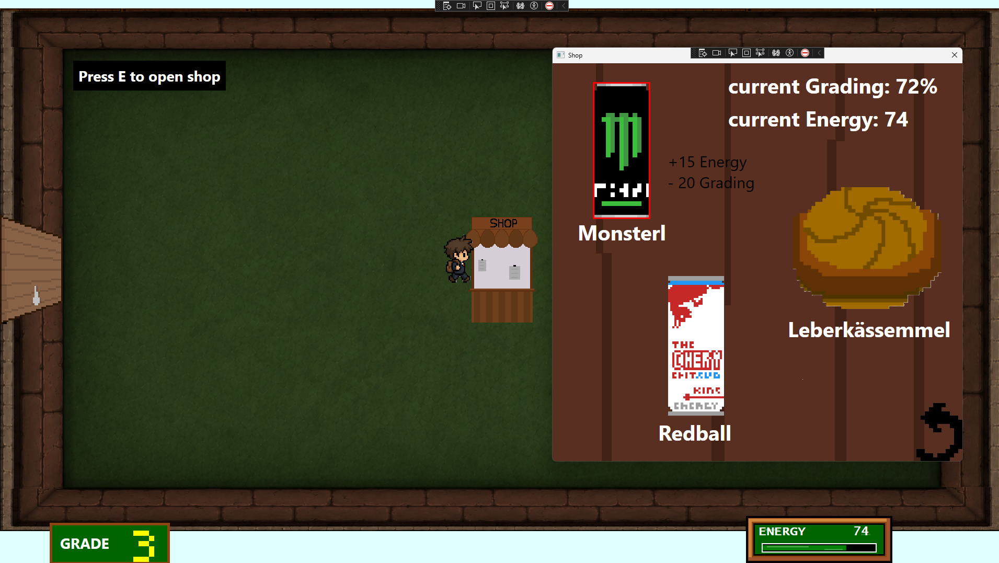
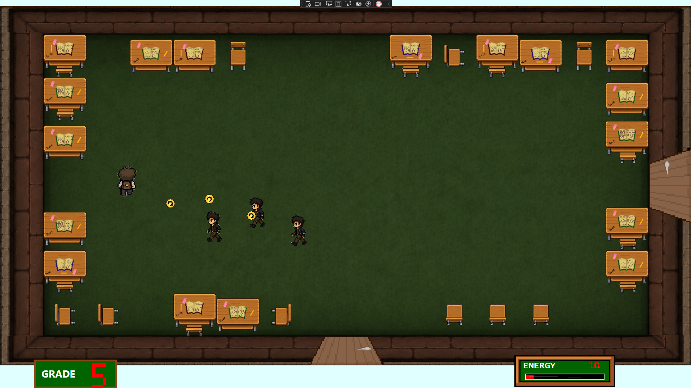

# 5 Jahre Hölle

## Überblick

__Projektmitglieder__: Valentin Hänsler, David Jäger 

__Klasse__: 2AHIF

__Jahr:__ 2025/26

__Kurzbeschreibung__: 

5 Jahre Hölle ist ein zweidimensionales Spiel, gemacht in WPF, C# welches der Kategorie Rougelike zugehörig ist. Der Sinn ist es, verschiedene Räume zu schaffen und zu erkunden und insgesamt 5 Level abschließen ohne dabei eine negative Note zu haben. 

## Inhaltsverzeichnis

- [5 Jahre Hölle](#5-jahre-hölle)
  - [Überblick](#überblick)
  - [Inhaltsverzeichnis](#inhaltsverzeichnis)
  - [Softwarevoraussetzungen](#softwarevoraussetzungen)
  - [Architektur und Funktionsblöcke](#architektur-und-funktionsblöcke)
  - [Detaillierte Umsetzungsbeschreibung](#detaillierte-umsetzungsbeschreibung)
    - [Projektzeitplan](#projektzeitplan)
  - [Probleme und Lösungen](#probleme-und-lösungen)
  - [Testung des Projekts](#testung-des-projekts)
  - [Bedienungsanleitung](#bedienungsanleitung)
  - [Quellenverzeichnis](#quellenverzeichnis)

## Softwarevoraussetzungen

Zum Ausführen des Projekts wird .NET 8 benötigt. Zusätzlich werden die NuGet-Pakete Serilog, Serilog.Sinks.File und Serilog.Sinks.Console verwendet.

## Architektur und Funktionsblöcke

Das Projekt läuft immer gleich. Beim Start wird vom Main-Window auf eine andere Page weitergeleitet die das Menü abbildet.Wird versucht, einen Spielstand zu laden, obwohl noch keiner existiert, wird dies durch eine Exception erkannt. Sonst kommt man auf die Game-Page mit dem gespeichertem Spielstand. Sonst kann man auf Difficulty gehen (was zu einer neuen Page weiterleitet) und ein Difficulty wählen. Nun sollte man auf der Game-Page sein. Hier werden verschiedene Klassen implementiert und im Gameloop verwendet.

## Detaillierte Umsetzungsbeschreibung

Direkt als nächster Unterpunkt kann die zeitliche Einteilung gesehen werden. 
Am Anfang des Projekts gab es zunächst die Planungsphase. Hier haben wir unsere Ideen, wie auch Must-/Nice-To-Haves notiert, welche in den anderen Planungsfiles gesehen werden können.

Dann haben wir mit dem Erstellen von mehreren Grafiken und dem Einrichten von einem Git-Repository begonnen. Als wir ein paar Grafiken hatten, begannen wir mit dem eigentlichen Programmieren. Dann haben wir ein Menü erstellt und im Hintergrund haben wir eine zufällige Map Generieren lassen, welche dann auch mithilfe von der gemachten Room-Klasse grafisch erstellt wurde.

Als Nächstes haben wir eine Animation zwischen den Räumen gemacht, und Objekte in die Räume getan (mithilfe von 20 vorgegebenen Raumstrukturen).

Dann wurde der Player erstellt, mitsamt Schießen und Kollisionen (mit den Objekten), und für die Exam-Rooms wurde ein neues Subwindow-File erstellt. 

Die Nächsten großen Fortschritte, waren das Erstellen von einem Pause-Menü (neues Subwindow), das Erstellen von Gegnern (eigene Klasse), welche Schießen und laufen können, und das Grading / Energy System (beides sind UCs).

Dann wurden Bosses (wieder als eigene Klasse), Achievments, ein Win-/Losescreen und das Speichern und Laden, als JSON-Format, eingebunden.

Nach dieses Features wurde nur noch das ganze geloggt, und vieles wurde verbessert, wie beispielsweise Shop/Boss/Achievments und noch viel mehr.

### Projektzeitplan

|Datum|Zeit|Aufgabe|Bearbeiter|
|---|---|---|---|
|05.05.2026  | 14:15 - 17:00  | Planung des Projektes  | Valentin & David  | 
|06.05.2026   |8:00 - 10:30   | Klassendiagramme Zeichnen  | David  |
|06.05.2026   |18:00 - 19:00   | Background Design  |David   |
|06.05.2026   | 10:30 - 12:30  |   Git Repo gemacht & Planung fortgesetzt  | Valentin   |
| 07.05.2026  |  8:00 - 10:00  | Background Design  | David   |
| 08.05.2026  | 7:30 - 9:00  | Planung fertig & Repo einrichten  | Valentin   |
|08.05.2026   | 9:00 - 10:00   | Planung fertig  | David  |
| 09.05.2026  | 15:30 - 17:00  | Grafiken erstellt  | David  |
| 10.05.2026  | 10:30 - 11:15  | Grafiken angepasst  | Valentin   |
| 10.05.2026  | 15:45 - 18:30  | Ganzen Menü  | David  |
| 10.05.2026   |  19:30 - 20:15 |Game Page & random Map Generator   |Valentin   |
| 14.05.2026  |14:00 - 15:00   |Funktion fürs Sammeln von den Räumen   | Valentin  |
| 14.05.2026  |20:00 - 22:00   | Animationen bei Raumwechsel  | Valentin  |
| 15.05.2026   |16:00 - 17:00   |Objektgrafiken eingebunden   | Valentin  |
|17.05.2026  |14:45 - 15:20   | Mit Spritesheet experimentiert  | David  |
|20.05.2026   |16:30 - 18:00   |Player & Objekt Kollisionen   | David  |
| 23.05.2026  |14:00 - 16:00   | Schießen von Player   |David   |
|24.05.2026  |14:00 - 16:00   |Anfang mit Exam-Rooms   |Valentin   |
|24.05.2026   | 15:45 - 16:15  | Pausemenü   | David  |
|26.05.2026   | 15:00 - 17:00  | Update Pause Menü & Range hinzugefügt   | David   |
|26.05.2026   | 15:00 - 17:00  | Fertig mit Exam-Subwindow  |Valentin   |
|27.05.2026   | 10:00 - 12:00  | Enemies   | Valentin  |
|01.06.2026   | 9:00 - 10:00  | Türen implementiert  | Valentin  |
|01.06.2026   | 12:30 - 14:15  | Grading System & Difficulty   | David  |
| 02.06.2026  |14:00 - 16:00   | Statistics implementiert  |David   |
|04.06.2026   |12:00 - 13:30   | Energy-System  |David   |
| 04.06.2026  | 16:00 - 20:00  | Bosses geaddet   |Valentin   |
|05.06.2026   | 15:45 - 17:00  | Achievments  |David   |
|06.06.2026   | 10:00 - 13:00  | Speichern & Laden  |Valentin   |
|09.06.2026   |17:05 - 17:45   | Win & Losescreen   | David  |
|10.06.2026  |11:30 - 12:30   |Bugfixing   |Valentin & David   |
|11.06.2026  |18:30 - 20:45   | Gamelogik verknüpft  |Valentin   |
|12.06.2026   | 9:00 - 10:00  | Bugfixing (Shop-Pausierung & Boss-Shooting)  | Valentin  |
|12.06.2026   | 14:30 - 17:00   |Boss Assets & Animationen   |David   |
|12.06.2026   | 19:00 - 22:00  | Shop & Boss verbessert  |Valentin   |
| 21.06.2026  | 14:00 - 16:00  | Bugfixes & Achievments Upgrade  | Valentin  |
| 22.06.2026  | 13:00 - 17:00  | Logging   | David  |
| 23.06.2026 | 7:30 - 12:00 | Dokumentation | Valentin |

## Probleme und Lösungen

Eines der schwersten Probleme zu lösen, war die Optimierung vom Code, da WPF nicht für Spiele ausgelegt ist. Dies haben wir gelöst, indem wir keinen Dispatcher-Timer genommen haben, sondern stattdessen, ein anderes Timer-Tool, welches direkt von WPF kommt: CompositionTarget.Rendering.

Ein anderes Problem entstand beim Speichern und Laden von Spielständen, da es viele Daten abzuspeichern gibt, was das ganze sehr schwer gemacht hat. Dies haben wir jedoch einfach durch viel Nachdenken und mit Einsatz von KI gelöst.

Ein letztes Problem war die Kompilierung zur .exe Datei. Hier waren die Übergange (Animationen) mit Task.Delay um einiges langsamer. Das konnten wir aber lösen, indem wir eine andere, neue Klasse namens DoubleAnimation nahmen.

## Testung des Projekts

Das Projekt wurde durch einen Klassenkameraden, Peter, getestet, indem er einen Playthrough spielte. Durch ihn fanden wir ein paar kleine Bugs im Code und konnten gutes Feedback bekommen, welches zum Balancing von Stats führte. Alles in allem fand er das Projekt größtenteils gut.

## Bedienungsanleitung

Um das Spiel zu starten, muss man zuerst auf Start klicken, und dann einen gewünschten Schwierigkeitsgrad auswählen.
 Anschließend kann man mit den Tasten W, A, S und D sich fortbewegen. Dazu kann man mit den Pfeiltasten in die beliebige Richtung schießen. Durch die einzelnen  Räume navigiert man so, indem man durch eine Tür an der Wand lauft, um den Raum zu wechseln. Eines dieser Räume ist der Boss Room. Wenn man den Boss besiegt, indem man 5 Fragen richtig beantwortet während man eine Positive Note hat, gelangt man in das nächste Level. Andernfalls muss das Spiel von vorne begonnen werden. Dazu ist ein Raum ein Shop, indem Grading gegen Energy tauschen kann. Die restlichen Räume beinhalten Gegner, welche man besiegen muss, oder ein Buch in der Mitte des Raumes. Wenn man dieses berührt bekommt man eine Frage gestellt, welche zu +/- Grading führt.

Hier lassen sich noch ein paar Bilder vom Menü, von einem leeren Raum, vom Shop und von einem Raum mit Gegner drin sehen.

  
  
  
  

## Quellenverzeichnis

Im Git-Projekt befindet sich ein File namens licenses.txt, welches alle Bildlizenzen und Quellen enthält. Bei Interesse bitte dort nachschauen.

